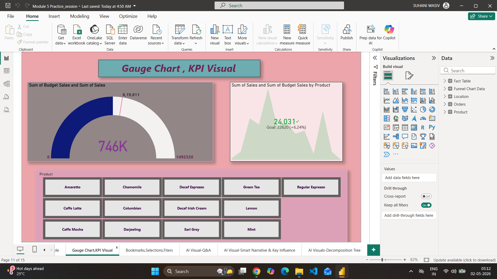

# 📘 Power BI & DAX Learning Journey

## 📌 Overview

This repository documents my learning journey in **Power BI and DAX (Data Analysis Expressions)**.
It includes module-wise datasets, practice exercises, and assignment solutions completed during my coursework.

---

## 📁 Repository Structure

```bash
uncleaned-datasets/
   module-2/
   module-3/
   module-4/
   module-5/
   module-6/
   module-7/
   module-8/
   module-9/

Assignment/
Practice_Session/
Solved_Assignment/
```

---

## 🛠️ Skills Covered

* DAX (Data Analysis Expressions)
* Data Cleaning & Transformation
* Data Modeling Basics
* Power BI Fundamentals
* Analytical Thinking

---

## 📊 What I Did

* Worked with multiple real datasets
* Cleaned and transformed raw data
* Created calculated columns and measures using DAX
* Solved assignment-based problems
* Built basic Power BI reports

---

## 📷 Screenshots

### 🔹 Repository Structure



### 🔹 Sample Dataset / Work


---

## 📄 Learning Summary

📥 Detailed documentation of my learning:
👉 **Power BI & DAX Learning Journey.pdf**

---

## 🎯 Purpose

This repository represents my **foundation phase** in Data Analytics before working on real-world projects.

---

## 🚀 Next Steps

* Build end-to-end Power BI projects
* Create dashboards (Sales, Supply Chain, etc.)
* Apply DAX in real-world scenarios

---

## 👩‍💻 Author

**Suhani Patra**

---

⭐ If you find this useful, consider giving it a star!
